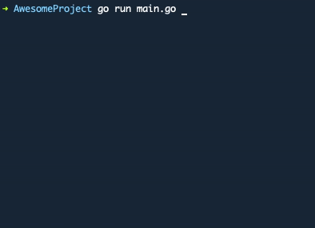
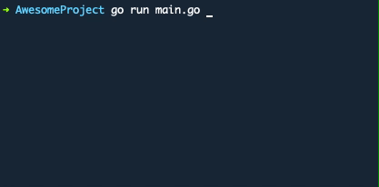

# Golang CLI Select
## Fork of https://github.com/Nexidian/gocliselect
In this fork I implemented submenu options so the items can be in a nested structure + some configuration options for cursor and colors.

## Examples

[examples/simple/main.go]()

[examples/advanced/main.go]()

## Known issues

#### Text flickering
Happening in iterm2 only. Tweaking some of these settings helped:

- General/Magic/GPU rendering
  - [x] Maximize throughput at the cost of higher latency

